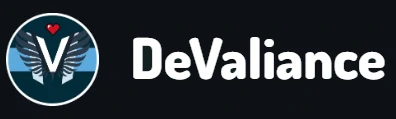
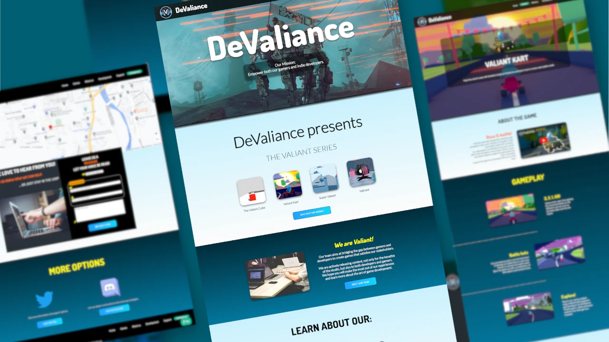

  

 

# 🕹️ DeValiance
> DeValiance is a fictitious small indie game development studio based in Mauritius. It is part of my university's coursework for the module web design (Software Engineering).

>Live demo:
[https://mistervaliant.github.io/devaliance/](https://mistervaliant.github.io/devaliance/ "DeValiance")

>

 

## ✒️ General Information 
DeValiance is the first website I have ever created from scratch using only HTML, CSS and JavaScript.

It is a static website that showcases real games I have created, and makes maximum use of all the different things I have learnt in the module. The project also consists of additional pages separated from the main website to learn Bootstrap and JavaScript.

 

## ❤️ Motivation
The aim of this project was to learn the basics of HTML, CSS and Javascript to create a static website. DeValiance came to birth for a strong passion in indie game development and to have a platform to demonstrate some video games I have developed using the Unity Game Engine.

 

## 👨‍💻 Technologies Used

  
  
  

 

## 📌 Features

- SwiperJs for vertical slider
- Form submission redirects to Bootstrap pages
- Embed Google map
- Image Map Resizer (Mobile-friendly image maps)

 

## 📷 Screenshots

 

## 🗺️ Room for Improvement
Issues:
- SwiperJs swipes more than once with mouse scroll
- Hamburger Navigation sometimes open when not pressed on mobile
- Videos in SwiperJs takes time to load

 

## 🔗 Acknowledgements
This project was inspired by [Chucklefish Games](https://chucklefish.org "Chucklefish")

_Music:_
- [Levi Niha](https://www.youtube.com/c/LeviNiha "Levi Niha")
- [Kevin MacLeod](https://www.youtube.com/channel/UCSZXFhRIx6b0dFX3xS8L1yQ "Kevin MacLeod")

_Other References:_
- [Unity Learn](https://learn.unity.com "Unity Learn")
- [Night School Studio](https://nightschoolstudio.com "Night School Studio")

 

## Contact
Created by [@MisterValiant](https://github.com/MisterValiant) - feel free to contact me! 📧

Project Status: **Completed**
